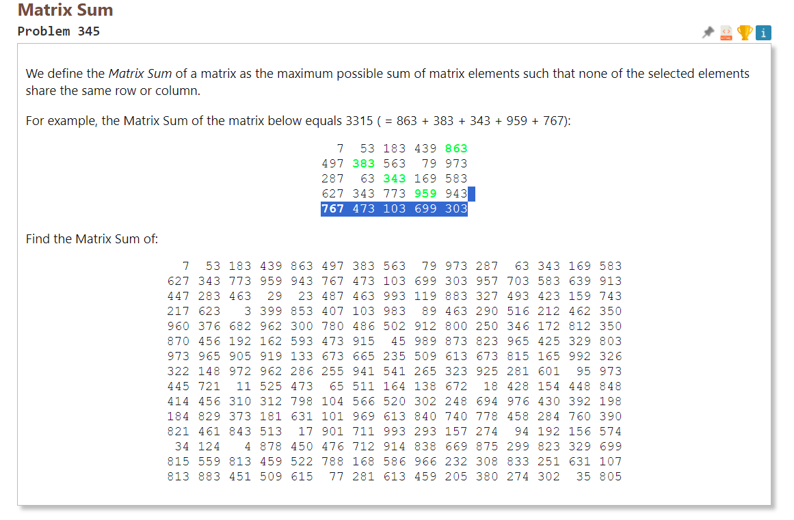

# Solution to Problem #345 of the Project Euler

## Problem statement

<p></p>

## MiniZinc Source code

This time **MiniZinc** a high-level `constraint modelling language` is used to solve the problem. Solver configuration: Gecode 6.3.0.

My preference usually goes to [Dynamic programming](https://en.wikipedia.org/wiki/Dynamic_programming) with conventional programming.

```MiniZinc
/*
 * Project Euler
 * Question 345
 * Matrix Sum
 * Link: https://projecteuler.net/problem=345
 *
 * Solution of the problem: 13938
 *
 * Written in MiniZinc 2.8.3
 *
 */

include "globals.mzn";

% Input data
int: n;
array[1..n, 1..n] of int: matrix;

% Decision variables
array[1..n] of var 1..n: assignments;

% Objective function
solve maximize sum(i in 1..n) (matrix[i, assignments[i]]);

% Constraints
constraint alldifferent(assignments);
constraint forall(i in 1..n) (
  exists(j in 1..n) (assignments[i] = j /\ matrix[i, j] >= 0)
);

% Output
output ["sum = \(sum(i in 1..n) (matrix[i, assignments[i]]))\n"];

% Data
n = 15;
matrix = array2d(1..n, 1..n,
  [  7, 53,183,439,863,497,383,563, 79,973,287, 63,343,169,583,
   627,343,773,959,943,767,473,103,699,303,957,703,583,639,913,
   447,283,463, 29, 23,487,463,993,119,883,327,493,423,159,743,
   217,623,  3,399,853,407,103,983, 89,463,290,516,212,462,350,
   960,376,682,962,300,780,486,502,912,800,250,346,172,812,350,
   870,456,192,162,593,473,915, 45,989,873,823,965,425,329,803,
   973,965,905,919,133,673,665,235,509,613,673,815,165,992,326,
   322,148,972,962,286,255,941,541,265,323,925,281,601, 95,973,
   445,721, 11,525,473, 65,511,164,138,672, 18,428,154,448,848,
   414,456,310,312,798,104,566,520,302,248,694,976,430,392,198,
   184,829,373,181,631,101,969,613,840,740,778,458,284,760,390,
   821,461,843,513, 17,901,711,993,293,157,274, 94,192,156,574,
    34,124,  4,878,450,476,712,914,838,669,875,299,823,329,699,
   815,559,813,459,522,788,168,586,966,232,308,833,251,631,107,
   813,883,451,509,615, 77,281,613,459,205,380,274,302, 35,396
  ]
);
```

 ## Output

 ```text

Running untitled_model.mzn
486msec

sum = 7469
----------
sum = 7549
----------
sum = 7559
----------
sum = 7829
----------
sum = 7909
----------
sum = 7949
----------
sum = 7969
----------
sum = 8349
----------
sum = 8429
----------
sum = 8645
----------
sum = 8665
----------
sum = 8847
----------
sum = 8997
----------
sum = 9021
----------
sum = 9177
----------
sum = 9228
----------
sum = 9248
----------
sum = 9430
----------
sum = 9437
----------
sum = 9638
----------
sum = 9708
----------
sum = 9798
----------
sum = 9968
----------
sum = 10221
----------
sum = 10261
----------
sum = 10313
----------
sum = 10331
----------
sum = 10365
----------
sum = 10448
----------
sum = 10618
----------
sum = 10674
----------
sum = 10754
----------
sum = 10874
----------
sum = 10898
----------
sum = 11018
----------
sum = 11025
----------
sum = 11077
----------
sum = 11095
----------
sum = 11212
----------
sum = 11382
----------
sum = 11444
----------
sum = 11456
----------
sum = 11466
----------
sum = 11498
----------
sum = 11533
----------
sum = 11820
----------
sum = 11849
----------
sum = 11952
----------
sum = 12117
----------
sum = 12167
----------
sum = 12340
----------
sum = 12390
----------
sum = 12438
----------
sum = 12586
----------
sum = 12648
----------
sum = 12660
----------
sum = 12670
----------
sum = 12702
----------
sum = 12737
----------
sum = 13024
----------
sum = 13027
----------
sum = 13045
----------
sum = 13330
----------
sum = 13333
----------
sum = 13357
----------
sum = 13580
----------
sum = 13625
----------
sum = 13683
----------
sum = 13708
----------
sum = 13773
----------
sum = 13799
----------
sum = 13906
----------
sum = 13938
----------
==========
Finished in 486msec.
```

The solution is 13938.

## References

[Project Euler](https://projecteuler.net)

[MiniZinc](https://www.minizinc.org)

[Gecode](https://www.gecode.org)

[D](https://dlang.org)

[Rust](https://www.rust-lang.org)


